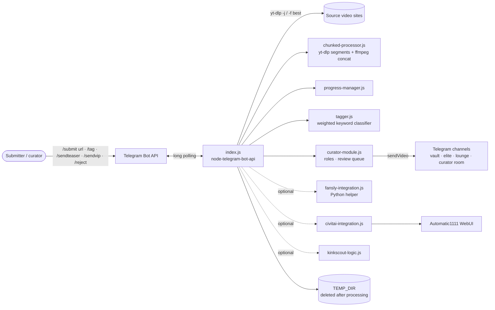
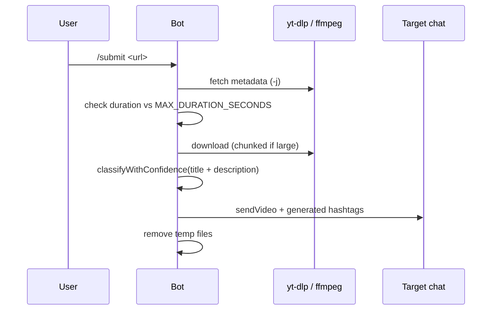

# HypnoTagger Bot

**Telegram bot that ingests videos from links, auto-tags them and routes them through a curator workflow**

[](https://github.com/FriskyDevelopments/hypnotagger-bot/actions/workflows/ci.yml) [](LICENSE)    

HypnoTagger is a Node.js Telegram bot prototype for an adult (18+) hypno/fetish content community. Send it a link with `/submit <url>`: it reads the metadata and downloads the video with `yt-dlp` (splitting long videos into chunks and joining them with `ffmpeg`), tags it with a **weighted keyword classifier** (`tagger.js`, not an LLM), and posts it with hashtags to the configured chat. Curators then send items to teaser/VIP channels or reject them. Optional modules add Fansly ingestion, local image generation through an Automatic1111 WebUI with Civitai models, and a "KinkScout" character persona. It's for channel operators and curators. The code is an **unfinished prototype**: see [SALVAGE_AUDIT.md](SALVAGE_AUDIT.md) for what's worth keeping.

## Architecture



### Submit lifecycle



## Stack

- Node.js ≥ 18, `node-telegram-bot-api`, `dotenv`
- `yt-dlp` and `ffmpeg` (system binaries), Python 3 for the Fansly helper
- ESLint, GitHub Actions and CircleCI configs
- Docker / docker-compose, Railway (Nixpacks), a Heroku deploy script

## Project structure

```text
index.js                 main bot: commands, submit pipeline, startup checks
tagger.js                weighted keyword classifier + category import/export
classify.js              interactive CLI for testing the classifier
chunked-processor.js     large-video download in segments + ffmpeg concat
progress-manager.js      progress messages / state
curator-module.js        curator roles and channel routing
fansly-integration.js    optional Fansly ingestion
civitai-integration.js   optional image generation (Automatic1111 + Civitai)
kinkscout-*.js           optional persona bot logic
test*.js, debug-*.js     ad-hoc test and debug scripts
index-corrupted.js       broken legacy entry point (do not use)
*.md                     setup, deployment and integration guides
```

## Local development

Requires Node.js 18+, plus `yt-dlp` and `ffmpeg` on the PATH.

```bash
# Install dependencies
npm install

# Template with the variable names the code actually reads (BOT_TOKEN, CHAT_ID, …)
cp .env.railway .env

# Run the bot (long polling)
npm start

# Classifier tests (node test.js)
npm test

# ESLint
npm run lint

# Interactive classifier CLI
npm run classify

# Check the token against getMe (needs BOT_TOKEN and jq)
npm run health
```

Commands registered in `index.js`: `/start`, `/submit <url>`, `/classify <text>`, `/categories`, `/export`, `/tag <content>`, `/sendteaser`, `/sendvip`, `/reject`, `/generate <prompt>`, `/aimodels`, `/switchmodel <name>`, `/kinkscout <scenario>`, `/scout_guide`, `/underground_map`, `/scout_wisdom`, `/enhance_kinkscout`. The older `/health` and `/help` commands from previous docs aren't implemented. See [COMMANDS.md](COMMANDS.md) and [BOTFATHER-COMMANDS.md](BOTFATHER-COMMANDS.md).

### Customizing tags

Categories, keywords, weights and context words live in `tagger.js` (`tagCategories`). Use `node classify.js` to test changes interactively and to export or import category sets.

## Environment variables

Names only. Note that `.env.example` uses different names (`TELEGRAM_BOT_TOKEN`, `TELEGRAM_CHANNEL_ID`) than the code, which reads `BOT_TOKEN` and `CHAT_ID`.

**Core**

- `BOT_TOKEN`
- `CHAT_ID`
- `ADMIN_CHAT_ID`
- `NODE_ENV`
- `TEMP_DIR`
- `MAX_FILE_SIZE_MB`
- `MAX_DURATION_SECONDS`

**Curator workflow**

`VAULT_CHANNEL_ID`, `ELITE_CHANNEL_ID`, `LOUNGE_CHANNEL_ID`, `CURATOR_ROOM_ID`, `ADMIN_CURATORS`, `SENIOR_CURATORS`, `JUNIOR_CURATORS`, `TRAINEE_CURATORS`, `AUTHORIZED_CURATORS`

**Optional integrations**

- `FANSLY_CONFIG`
- `PYTHON_PATH`
- `CIVITAI_API_KEY`
- `AUTOMATIC1111_URL`
- `KINKSCOUT_BOT_TOKEN`

**Listed in .env.example only**

- `TELEGRAM_BOT_TOKEN`
- `TELEGRAM_CHANNEL_ID`
- `OPENAI_API_KEY`
- `PORT`
- `FANSLY_API_KEY`
- `FANSLY_SESSION_ID`
- `DATABASE_URL`

## Deploy

The bot is a long-running polling process (no webhook or HTTP server), so it needs a host that keeps a worker alive:
- **Railway**: `railway.json` (Nixpacks, `npm start`, restart on failure) and `npm run deploy` (`deploy-railway.sh`). See [RAILWAY-DEPLOYMENT.md](RAILWAY-DEPLOYMENT.md).
- **Docker**: `Dockerfile` (node:18-alpine) and `docker-compose.yml`.
- **Heroku**: `deploy-heroku.sh` and `Procfile`.

The GitHub Actions deploy job is a placeholder, and the CI workflow is currently failing. More guides: [DEPLOYMENT-GUIDE.md](DEPLOYMENT-GUIDE.md), [QUICK-DEPLOY.md](QUICK-DEPLOY.md).

## Security

- Never commit `.env`. Only use `.env.example` / `.env.railway` as templates.
- A bot token appeared in committed scripts and guides in this repo's history. It must be treated as compromised: revoke it in @BotFather and scrub the history (see [SALVAGE_AUDIT.md](SALVAGE_AUDIT.md) and [SECURITY.md](SECURITY.md)).
- `index.js` builds `yt-dlp` shell commands from user-supplied URLs. Sanitize the input or switch to `execFile` before exposing the bot publicly.

## More docs

[CONTRIBUTING.md](CONTRIBUTING.md) · [CHANGELOG.md](CHANGELOG.md) · [PROJECT-STATUS.md](PROJECT-STATUS.md) · [LARGE-VIDEO-PROCESSING.md](LARGE-VIDEO-PROCESSING.md) · [FANSLY-INTEGRATION.md](FANSLY-INTEGRATION.md) · [CIVITAI-INTEGRATION.md](CIVITAI-INTEGRATION.md) · [KINKSCOUT-BOT.md](KINKSCOUT-BOT.md) · [TELEGRAM-SETUP-GUIDE.md](TELEGRAM-SETUP-GUIDE.md)

## License

See [LICENSE](LICENSE).
